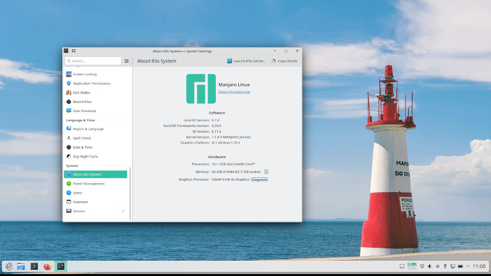

# SonicDE Packages for Manjaro Linux Systems

This third-party repository provides [SonicDE](https://sonicde.org) x86_64 binary  packages for [Manjaro Linux](https://manjaro.org). SonicDE, or the Sonic Desktop Environment, aims to preserve and improve the X11-specific aspects of KDE. You can learn more about SonicDE at [sonicde.org](https://sonicde.org).

## Installing SonicDE Manually

### Adding the Public Package Signing Key to pacman

First, please download the public OpenPGP signing key [`sonicde-manjarolinux.asc`](sonicde-manjarolinux.asc) used to sign the packages and add it to the pacman keyring:

```shell
curl -O https://sonicde-manjaro.github.io/sonicde-manjarolinux.asc
sudo pacman-key --add sonicde-manjarolinux.asc
sudo pacman-key --finger 358078F346BBFF4B
sudo pacman-key --lsign-key 358078F346BBFF4B
```

You can read more about package signing on the [pacman/Package signing - ArchWiki](https://wiki.archlinux.org/title/Pacman/Package_signing#Adding_unofficial_keys) page.

### Adding the Repository to Pacman

Once you added the public key, also add an entry for the SonicDE repository to the end of the file [`/etc/pacman.conf`](https://man.archlinux.org/man/pacman.conf.5) using [`sudo`](https://wiki.archlinux.org/title/Sudo) and your favorite editor:

```ini
[sonicde]
Server = https://sonicde-manjaro.github.io/$arch
```

Run `pacman` to update all package indexes and installed packages:

```shell
sudo pacman -Syyu
```

### Installing SonicDE

If you're using KDE Wayland, you'll need to disable the Plasma Login Manager before continuing. Otherwise you may not be able to login to your graphical session anymore. To do so, use the following command:

```shell
sudo systemctl disable plasmalogin
```

Installing SonicDE itself is as easy as installing the `sonicde-meta` package:

```shell
sudo pacman -S sonicde-meta
```

The included packages will replace any of their installed KDE counterparts. When asked, just answer with `y`. In case you get kicked out of your graphical session while installing SonicDE on a KDE Wayland system, switch to a [text console](https://wiki.archlinux.org/title/Linux_console) via, e.g., `Ctrl+Alt+F3`, login in as your regular user and enter the following commands:

```shell
sudo pacman -S sonicde-meta
sudo systemctl stop plasmalogin
sudo systemctl enable soniclogin
sudo systemctl start soniclogin
```

It'll enable the Sonic Login Manager and bring you back to a graphical greeter. When logged in again, start the program `System Settings` and verify that you're running SonicDE on the "About this System" page. You do? Congratulations!

P.S. If you prefer SDDM or any other X11 login manager, you may keep using it. This guide just wants to make sure that every user gets back to some sort of graphical greeter.

## Getting in Contact

Please report any enhancement requests or issues with this repository at [Issues · sonicde-manjaro/sonicde-manjaro](https://github.com/sonicde-manjaro/sonicde-manjaro/issues). If you have a specific issue, please see the [list of package repositories](https://github.com/orgs/sonicde-manjaro/repositories?q=topic%3Apackage) and report it there. In case you need help, want to report success, or talk about other aspects, please also check the official SonicDE channels.

&nbsp;[Bluesky](https://bsky.app/profile/sonicdesktop.bsky.social)&nbsp; &nbsp;[Discord](https://discord.gg/cNZMQ62u5S) &nbsp; &nbsp;[Mastodon](https://mastodon.social/@sonicdesktop) &nbsp; &nbsp;[Matrix](https://matrix.to/#/#sonicdesktop:matrix.org) &nbsp; &nbsp;[OFTC IRC](https://webchat.oftc.net/?channels=sonicde%2Csonicde-devel%2Csonicde-dist&uio=MT11bmRlZmluZWQb1) &nbsp; &nbsp;[Telegram](https://t.me/sonic_de) &nbsp; &nbsp;[X (Twitter)](https://x.com/SonicDesktop)
